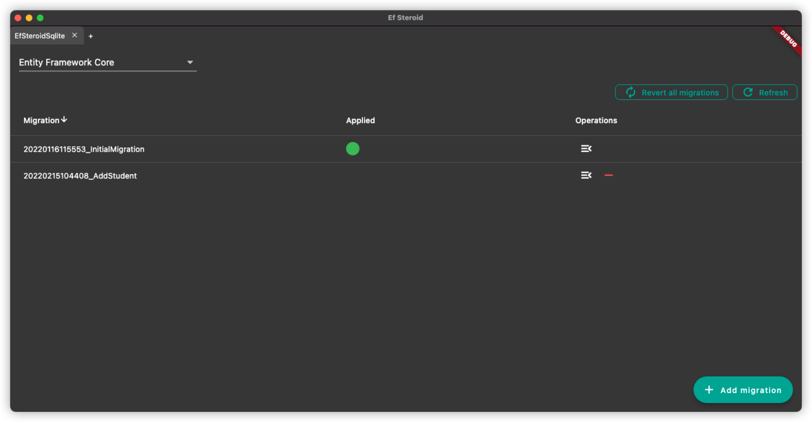

> This project is still in development.

# Ef Steroid

---

Ef Steroid is a GUI application for [Entity Framework](https://docs.microsoft.com/en-us/ef/).

## Features

- [x] Support EFCore 6.0
- [x] Support EF6 (Windows only, please file an issue for macOS support, we will work on it if it is up-voted)
- [ ] Other EF versions (please file an issue if you need it)
- [ ] Linux support (please file an issue if you need it)
- [x] View migrations in table format
- [x] Select migration in the table to update database to the targeted migration
- [x] Select migration in the table to delete the targeted migration (may vary depending on EF Core/Ef6)
- [x] Add migration



## Development

### macOS

Run the following commands:

```
brew install needle
flutter pub get
flutter pub run build_runner build
flutter run
```
